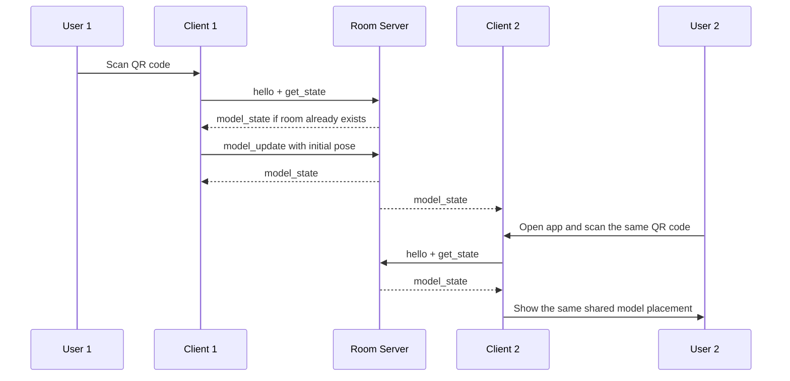

# templateAR-iwsdk

Multiplayer AR experience built with IWSDK.

The app uses a QR code to anchor a shared 3D model in the room. One user scans the QR code, the client estimates the initial placement, and the room server broadcasts that shared state to every other client.

## What it does

- Loads a GLTF model into an AR scene.
- Captures a back-facing camera stream and scans it with `jsQR`.
- Uses the QR marker pose as the anchor for model placement.
- Shares model state over a WebSocket room server.
- Stores the latest shared model state in memory and writes a debug snapshot to disk.

## Project Structure

```text
index.html
package.json
README.md
tsconfig.json
vite.config.ts
public/
server/
	model_state.json
	roomServer.js
src/
	index.ts
	uniformScaleModel.ts
	sync/
		networkSystem.ts
```

## Runtime Flow

1. `npm run dev` starts the Vite dev server on `https://localhost:8081`.
2. `src/index.ts` creates the IWSDK world, loads the model, and registers the systems.
3. `src/sync/networkSystem.ts` opens a WebSocket connection to `/room` and sends a `hello` message.
4. The system captures frames from the back camera and scans for a QR code.
5. The first valid QR scan becomes the room marker and is used to estimate the initial pose.
6. The client requests the current room state with `get_state` before publishing a new placement.
7. `server/roomServer.js` keeps the authoritative room state in memory, broadcasts `model_state`, and writes `server/model_state.json` for debugging.

## Multiplayer Sequence



## Important Files

- [src/index.ts](src/index.ts) creates the IWSDK world, loads the model, and registers systems.
- [src/sync/networkSystem.ts](src/sync/networkSystem.ts) handles QR scanning, pose estimation, socket sync, and model updates.
- [src/uniformScaleModel.ts](src/uniformScaleModel.ts) keeps the model uniformly scaled.
- [server/roomServer.js](server/roomServer.js) stores and broadcasts the shared room state and writes the debug JSON snapshot.

## Scripts

- `npm run dev` starts the Vite dev server on `https://localhost:8081` with the IWSDK dev plugin enabled.
- `npm run server` starts the WebSocket room server on `ws://localhost:8787` and the debug HTTP endpoint on `http://localhost:8788/model_state.json`.
- `npm run build` builds the app for production into `dist/`.
- `npm run preview` previews the production build locally.

## Setup

```bash
npm install
npm run server
npm run dev
```

Open `https://localhost:8081` in the browser after both servers are running.
If you only need the browser app and not shared state, `npm run dev` can still load the scene, but multiplayer sync will not work until `npm run server` is running.

## How the QR anchoring works

The QR code is used as an anchor, not as the shared room identity itself.

- The client scans the QR code.
- The marker ID identifies the scanned room marker.
- The client estimates the marker pose from the QR corners.
- The client requests the current room state before publishing a new placement.
- The first client to publish becomes the authoritative owner of the model state.
- Other clients receive the same state and render the model from the shared placement.

## Troubleshooting

- If `npm run server` fails with `EADDRINUSE`, another process is already using port `8787` or `8788`.
- If the browser shows WebSocket errors for `/room`, make sure `npm run server` is running and reload the page.
- If the model does not appear, confirm the QR code is visible to the camera and the room server has a shared `model_state`.
- If the debug snapshot is stale, open `http://localhost:8788/model_state.json` to confirm the server is receiving updates.

## Notes

- `src/sync/networkSystem.ts` uses `jsQR` plus marker pose estimation to derive the initial shared placement.
- The room server also writes debug state to `server/model_state.json` and serves it at `http://localhost:8788/model_state.json`.
