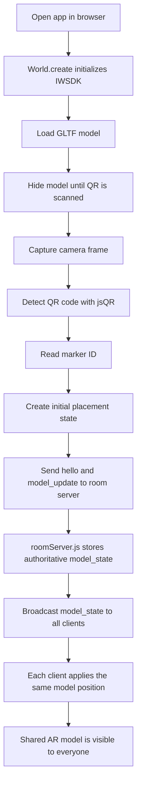
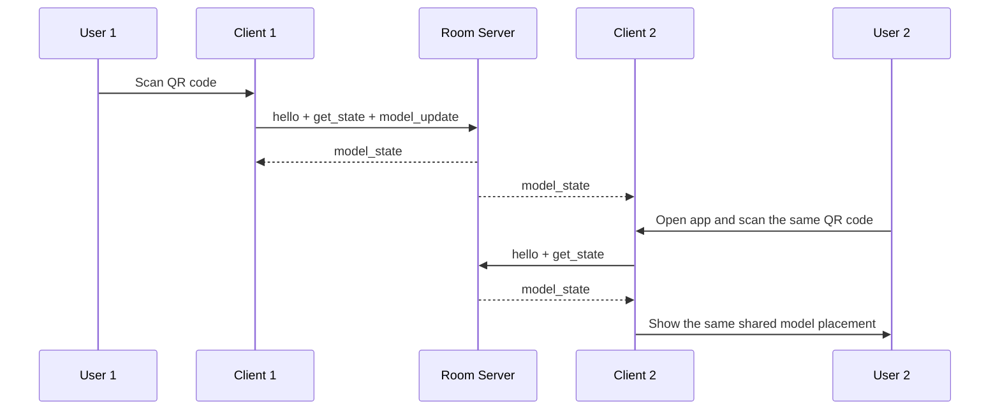

# templateAR-iwsdk

Multiplayer AR experience built with IWSDK.

The app uses a QR code to anchor a shared 3D model in the room. One user scans the QR code, the client creates the initial placement, and the room server broadcasts that shared state to every other client.

## What it does

- Loads a GLTF model into an AR scene.
- Detects a QR code with the device camera.
- Uses the QR scan as an anchor for model placement.
- Shares model state over a WebSocket room server.
- Keeps the same model rotation for every user.

## Project Structure

```text
index.html
package.json
README.md
tsconfig.json
vite.config.ts
public/
server/
	model_state.json
	roomServer.js
src/
	index.ts
	uniformScaleModel.ts
	sync/
		networkSystem.ts
```

## Runtime Flow

1. The app starts in the browser with `npm run dev`.
2. `src/index.ts` creates the IWSDK world and loads the model.
3. `src/sync/networkSystem.ts` captures the camera frame and scans for a QR code.
4. The QR marker ID becomes the room anchor.
5. The client publishes the first placement to `server/roomServer.js`.
6. The server stores the shared model state and broadcasts it to connected users.
7. Every client applies the same shared state, so the model appears in the same place for everyone.

## Flow Chart



## Multiplayer Sequence



## Important Files

- [src/index.ts](src/index.ts) creates the IWSDK world and registers systems.
- [src/sync/networkSystem.ts](src/sync/networkSystem.ts) handles QR scanning, socket sync, and model updates.
- [src/uniformScaleModel.ts](src/uniformScaleModel.ts) keeps the model uniformly scaled.
- [server/roomServer.js](server/roomServer.js) stores and broadcasts the shared room state.

## Scripts

- `npm run dev` starts the Vite dev server on `https://localhost:8081`.
- `npm run server` starts the WebSocket room server on `ws://localhost:8787`.
- `npm run build` builds the app for production.
- `npm run preview` previews the production build.

## Setup

```bash
npm install
npm run server
npm run dev
```

Open `https://localhost:8081` in the browser after both servers are running.

## How the QR anchoring works

The QR code is used as an anchor, not as a rotation source.

- The client scans the QR code.
- The marker ID identifies the shared room anchor.
- The client publishes the initial model state.
- The server keeps the authoritative model state.
- Other clients receive the same state and render the model without adding a different rotation.

## Troubleshooting

- If `npm run server` fails with `EADDRINUSE`, another process is already using port `8787`.
- If the browser cannot connect to the room, make sure `npm run server` is running.
- If the model does not appear, confirm the QR code is visible to the camera and the room server has a shared `model_state`.

## Notes

- This project keeps the model rotation unchanged when loading from QR placement.
- The room server also writes debug state to `server/model_state.json` and serves it at `http://localhost:8788/model_state.json`.
